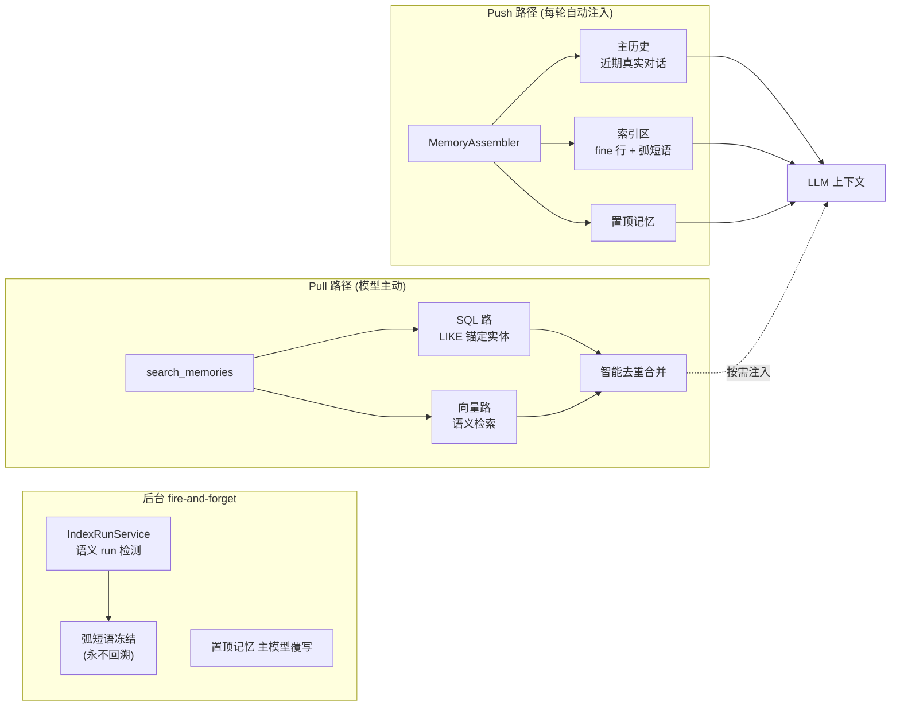

# Personal Agent Assistant

[English](README_EN.md) | 中文

一个生产级、真实运行的个人 AI 助手, 核心是**长期对话的记忆系统**与**渐进式工具编排**. 基于 LangChain v1.0 Agent 框架, v1.9.0.

---

## 这是什么 / 不是什么

**是**

- 一个完整、真实运行的个人助手 (生产环境持续运行中)
- 长对话记忆系统的设计参考 — 解决"对话越长质量越差"的根因
- 渐进式工具编排的工程实践 — 不把所有能力一次性塞进上下文
- 基于 LangChain v1.0 Agent + middleware 的生产级实现

**不是**

- 可独立复用的记忆库 — 记忆系统深度耦合在应用内, 非独立包
- 开箱即用的产品 — 运行门槛高, 强依赖中文/中国生态
- 有基准测试的学术项目 — 效果基于真实用户反馈, 暂无公开 benchmark

---

## 第一性原理

```
Agent = 上下文 + 工具 + LLM
```

上下文管理与工具、LLM 同为一等公民, 不是附属. 本项目的核心投入在**上下文管理**这条最被低估的轴上.

---

## 核心设计 — 记忆系统

### 问题: 对话越长, 质量为什么越差?

主流长对话方案有两类, 各有硬伤:

- **Compact (摘要压缩)**: 丢细节. 传统对话 agent 长对话质量偏移的根因 — 一旦把早期对话压成摘要, 具体事实、措辞、因果链条就不可逆地损失了.
- **纯 RAG (每轮检索喂上下文)**: 在**用户输入毫无约束**的真实场景下效率低, 且检索到的不可预测上下文会干扰 LLM, 让回复偏离用户本意.

### 洞察: 对话历史本身是高价值知识库

在"用户短输入、agent 完整输出"的常见交互模式下, **agent 的回复本身就是高价值提炼知识**. 因此必须保留 agent **完整回溯历史对话**的能力, 不能丢.

### 方案

不走 compact, 也不靠每轮 RAG. 采用 **Push 优先 + 全量保留 + 远期弧短语** 的组合:

**1. SQL 存全量原文, 向量仅作检索辅助**

每一轮对话的 `user_message` / `assistant_response` / `topic` / `summary` 完整落入 SQLite, 永不压缩丢弃. 这保证了"回溯完整对话"的能力. 向量 (ChromaDB) 只是检索加速手段, 不是知识载体.

**2. Push 路径 — 自动注入近期高质量上下文 (不依赖用户输入)**

每轮由 `MemoryAssembler` 自动组装上下文, 无需用户输入触发, 对抗纯 RAG 的不可预测性:

- **主历史** (近期真实对话): 滚动有界窗口, 独立字符预算 (默认 20000), 命中缓存零 DB 读
- **索引区** (早期对话概览): **预算驱动级联** — 近期 fine 行 (受预算约束) + 老期弧短语 (不受约束, 保时间线连续)
- **置顶记忆** (pinned memory): 用户长期事实, 拼入 system prompt

**3. 语义 run + 弧短语冻结 (对抗 compact 的一刀切)**

后台 fire-and-forget 任务 (`IndexRunService`): 每轮取 summary 的 embedding, 与未闭合 run 的末轮比余弦相似度. 话题切换时 (相似度 < 阈值), 闭合当前 run, 由 LLM 蒸馏**一句弧短语**冻结写入, **永不回溯修改**.

弧短语兼具检索钩子 (语义线索) 与时间连续性 (按序拼接 = 早期对话演变轨迹). 这让远期对话在不丢时间线的前提下被压缩 — 而非 compact 式的信息抹除.

**4. 预算驱动级联 — 上下文几乎不膨胀**

主历史与索引区是**两个独立预算**, 不按比例切分总量. 近期对话精细回顾 (fine 行), 远期对话粗粒度概览 (弧短语). 随对话增长, 上下文长度趋于稳定而非线性膨胀.

**5. Pull 路径 — 模型主动回忆 (search_memories)**

作为 Push 的补充, 模型可通过 `search_memories` 工具主动检索更早的特定内容. 这是**平等双路检索**:

- **SQL 路**: query 分词 → `LIKE ANY` 命中 `user_message` / `assistant_response`, 专职锚定**专有名词 / 实体名** (向量检索中常欠加权的词)
- **向量路**: ChromaDB 语义检索
- **合并**: 智能去重, 向量命中用真实相似度分, SQL-only 命中用中性分 0.5



### 当前状态

- **已验证**: 300-500 轮对话的稳定连续, 基于真实测试用户反馈 (长对话无明显质量偏移)
- **目标**: 数年跨度的 **5000 轮+** 对话稳定 recall + 用户体感连续, 同时上下文长度几乎不膨胀
- **诚实声明**: 暂无公开 benchmark. 后续计划接入合适的对话记忆评测集或自建.

> 核心代码: `src/agent/memory/local_memory/` (assembler / core / index_run_service / pinned_memory) + `src/storage/service/retrieval_service.py` (双路检索)

---

## 整体架构

### 分层依赖 (单向向下)

```
api (路由) -> session (消息队列/编排) -> agent (Agent框架)
          -> tools / files / inference / storage.service -> storage.dao -> core (叶子)
```

`core` 是零上层依赖的叶子层 (路径解析 / 流式 / 上下文 / 生命周期). 横切层 `config` / `utils` 可被任意层单向依赖.

### 对话模型 — 单轮 React 与上下文隔离

**单轮完整 React 循环**: 超长期单线程对话场景下, 每次用户输入触发一个完整的 ReAct 循环 (LangChain v1.0 `create_agent` 接管, 仅通过中间件 retry / tool_call_limit / discovery / skill_load 干预), 暂未做人在回环. 一个 prompt 内 agent 完全独立.

**工具信息不跨循环**: 对话持久化只存 `user_message` + `assistant_response` (最终回复), ReAct 循环中的工具调用轨迹 (`tool_calls` / `ToolMessage`) 不落库. 因此下一轮的 Push 上下文看不到上一轮的工具调用细节.

**对工具 / Skill 设计的约束**: 错误信息不跨循环传递 — 两次独立的 prompt 中, 模型可能调用同样工具、犯同样错误. 这要求工具设计自包含容错, Skill 的操作说明需预防常见误用.

**专家工具 = Subagent 包装**: 为保证上下文干净与简化设计, subagent 被包装为 LangChain tool (`BaseExpertTool`). 主 agent 看到的是一个普通工具, 内部却是独立的 `create_agent` 编排 (如网络调研 / 地图导航). 子 agent 的多步推理不污染主 agent 上下文, 主 agent 只收到最终结果.

### 工具系统 — 渐进式能力披露

**第一性原理的延伸**: 不把所有工具一次性塞进上下文 (浪费 token + 选择困难), 而是按需发现注入. Agent 启动只加载**核心工具** + `search_available_tools` + `load_skill`.

**四类工具源**:

| 类型 | 隔离 | 说明 |
|------|------|------|
| 内部工具 | user/thread/agent 三级 | 需数据安全, 如记忆检索 / TODO / 用户要求记事本 |
| 外部工具 | 无状态全局 | 封装外部 API, 如天气 / 图表 / Python 执行 |
| 专家工具 | 全局共享 | 独立 Agent 编排多源工具, 如网络调研 / 地图导航 (subagent 包装, 见对话模型) |
| MCP 工具 | 全局共享 | McpBridge 集成, 支持 streamable_http / sse / stdio |

**休眠工具发现 + 注入** (两套同构中间件, 基于 LangChain v1.0 `AgentMiddleware`):

1. 模型调用 `search_available_tools(query)` (同义词扩展 + 子串匹配 + LLM 去噪) → 返回匹配工具
2. `ToolDiscoveryMiddleware` 扫描 ToolMessage 结果 → 激活休眠工具 → `awrap_model_call` 注入后续调用, `awrap_tool_call` 路由调用
3. **工具组透明展开**: 工具组 (group) 对主对话模型透明, 搜索命中组名时自动展开为整组成员

> 核心代码: `src/tools/tools_manager.py` + `src/tools/middleware/_tool_discovery.py`

### Skills — 横跨上下文与工具的组合能力

> Skill **不是工具的子集**. 在 `Agent = 上下文 + 工具 + LLM` 中它没有独立位置 — 它是横跨"上下文"与"工具"两个域的组合能力包.

对齐 [Anthropic Agent Skills](https://agentskills.io/specification) 规范, 三级渐进式披露:

| 级别 | 内容 | 触发 |
|------|------|------|
| L1 清单 | name + description (~100 tokens) | 构建期注入系统提示词 |
| L2 正文 | SKILL.md body (<5000 tokens) | `load_skill(skill_name)` 返回 |
| L3 引用 | references/xxx.md | `load_skill(skill_name, reference="xxx")` 按需 |

加载一个 Skill **同时**注入它的领域知识 (L2/L3, 上下文域) 和它的关联工具 (`associated_tools` 经 `SkillLoadMiddleware` 动态注入, 工具域). per-skill 隔离, 不同 Skill 的工具互不影响. 含路径遍历防护 (reference 名严格校验).

后端类型: `prompt_only` (纯知识 + 关联工具) | `executable` (经 tool-runtime 执行代码, 产物回收为 file_id).

> 核心代码: `src/tools/skills/skill_bridge.py` + `src/tools/middleware/_skill_load.py`

### 文件管理

用户级附件全生命周期管理, 与记忆/健康子系统边界对齐:

- **SHA-256 内容去重**: 用户级哈希去重, 相同内容只存一份 (引用计数实时查询, 无需维护计数字段)
- **配额管理**: 用户级存储配额, 超限自动清理最早文件
- **描述分层**: `brief` (简短, 入 DB) + `detail` (详细, 外置 `.desc.md` 文件, 避免撑大数据库)
- **依赖注入解耦**: `ImageDescriberProtocol` 让文件层不直接依赖推理层, 描述生成策略由调用方决定 (非多模态同步生成 / 多模态后台补全)

> 核心代码: `src/files/repository.py`

### 多 Agent 物理隔离

每个 Agent 拥有独立的 `database/` + `vector/` 目录, 文件系统级隔离. 配置驱动 (`agent.yaml`), 零硬编码. 当前含 Personal / Health / Thought 三个 Agent, 各自独立的身份、提示词、模型、工具、记忆预算.

### 渠道接入

借助 [OpenClaw](https://github.com/openclaw/openclaw) gateway 接入微信 / Telegram / WhatsApp 等广泛 IM 渠道.

**关键**: 本项目**完全自主编排** — 记忆 / Agent / 工具 / Skills 全部自研, **主动清理** OpenClaw gateway 注入的 system prompt / 元数据 / 心跳 / 智能上下文, **仅用其消息通道能力** (入站收消息、出站经 `/tools/invoke` 发消息). 暴露标准 OpenAI 兼容 API, 也可不经任何 gateway 直接对接.

> 核心代码: `src/core/openclaw_filter.py` (入站过滤) + `src/core/openclaw_client.py` (出站发送)

---

## 技术栈

| 层 | 选型 |
|------|------|
| Agent 框架 | LangChain v1.0 (Agent + middleware) |
| Web 框架 | FastAPI (OpenAI 兼容 API + 流式) |
| 存储 | SQLModel + SQLite (per-agent) |
| 向量 | ChromaDB (per-agent) |
| 部署 | Docker 多容器 (app / tool-runtime / quote-service) |

模型: DeepSeek / OpenAI / 本地 LLM (Ollama) / 嵌入 (bge-m3, 本地) / 视觉 (可选). 具体模型 ID 以 `src/inference/llm/definitions/builtin_data.py` 为准.

---

## 项目状态

- **成熟度**: 个人项目, 生产环境持续运行, 300+ 源文件 / 3000+ 单元测试 / 分层架构 / CI 门禁
- **局限**: 强依赖中文/中国生态 (A股行情 / 火山引擎模型 / 微信渠道); 记忆系统无公开 benchmark
- **反馈**: Issues 欢迎 / 邮件 [jsjrjft@outlook.com](mailto:jsjrjft@outlook.com); **不接受 PR** (个人项目, 暂不开放协同)

---

## 文档

- [配置系统](docs/configuration.md) | [config.yaml 参考](docs/config-yaml-reference.md)
- [缓存设计](docs/development/cache-design.md) | [路径管理](docs/path-management.md)
- [工具系统设计规范](docs/development/tool-design-specification.md)
- [Skills 接入设计](docs/development/skills-integration.md)
- [测试体系](tests/README.md) | [更新日志](docs/changelog.md)

## 许可证

MIT
