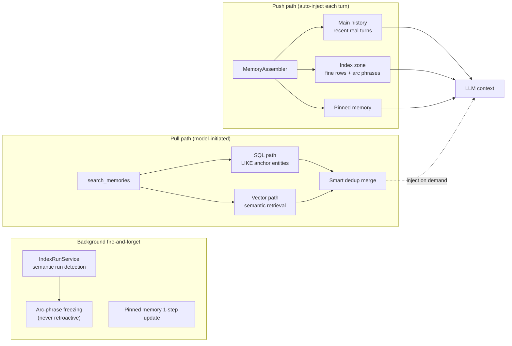

# Personal Agent Assistant

English | [中文](README.md)

A production-grade, real-world personal AI assistant centered on **long-conversation memory** and **progressive tool orchestration**. Built on LangChain v1.0, v1.9.0.

---

## What it is / isn't

**Is**

- A complete, real-world personal assistant (running in production)
- A design reference for long-conversation memory — tackling the root cause of "longer conversation, worse quality"
- An engineering practice of progressive tool orchestration — not stuffing all capabilities into context at once
- A production implementation based on LangChain v1.0 Agent + middleware

**Isn't**

- A reusable memory library — the memory system is deeply coupled inside the app, not a standalone package
- An out-of-the-box product — high run barrier, strong dependency on the Chinese/China ecosystem
- An academic project with benchmarks — effects based on real user feedback, no public benchmark yet

---

## First Principle

```
Agent = Context + Tools + LLM
```

Context management is a first-class citizen alongside tools and LLM, not an afterthought. This project invests heavily in the most under-appreciated axis: **context management**.

---

## Core Design — Memory System

### The Problem: why does quality degrade as conversations grow?

Two mainstream long-conversation approaches, each with hard flaws:

- **Compact (summarization)**: loses detail. This is the root cause of quality drift in traditional conversational agents — once early conversation is compressed into a summary, specific facts, phrasing, and causal chains are irreversibly lost.
- **Pure RAG (retrieve-and-inject every turn)**: in real-world scenarios where **user input is unconstrained**, it's inefficient, and the unpredictable retrieved context distracts the LLM, pushing responses off the user's intent.

### Insight: conversation history IS the knowledge base

In the common interaction pattern of "short user input, full agent output", **the agent's responses themselves are high-value distilled knowledge**. Therefore, the agent must retain the ability to **fully backtrack the complete conversation history** — nothing can be dropped.

### Solution

No compact, no per-turn RAG. Instead: **Push-first + full retention + arc-phrase summarization for distant history**.

**1. SQL stores full transcripts; vectors serve only retrieval**

Every turn's `user_message` / `assistant_response` / `topic` / `summary` is fully persisted in SQLite, never compressed or dropped. This guarantees the ability to "backtrack the complete conversation". Vectors (ChromaDB) are merely retrieval accelerators, not the knowledge carrier.

**2. Push path — auto-inject recent high-quality context (not triggered by user input)**

Each turn, `MemoryAssembler` automatically assembles context — no user input needed, countering RAG's unpredictability:

- **Main history** (recent real conversation): rolling bounded window, independent char budget (default 20000), cache hit = zero DB read
- **Index zone** (early conversation overview): **budget-driven cascade** — recent fine rows (budget-constrained) + older arc phrases (unconstrained, preserve timeline continuity)
- **Pinned memory**: long-term user facts, appended to system prompt

**3. Semantic run + arc-phrase freezing (countering compact's blanket loss)**

A background fire-and-forget task (`IndexRunService`): each turn, take the summary's embedding and compare cosine similarity with the last turn of the unclosed run. On topic switch (similarity < threshold), close the current run and have the LLM distill **one arc phrase**, freeze it to DB, **never retroactively modified**.

Arc phrases serve dual roles: retrieval hooks (semantic clues) and timeline continuity (concatenated in order = early conversation evolution trajectory). This compresses distant history without losing the timeline — unlike compact's information erasure.

**4. Budget-driven cascade — context barely grows**

Main history and index zone are **two independent budgets**, not proportionally sliced from a total. Recent conversation is reviewed in detail (fine rows); distant conversation in coarse overview (arc phrases). As conversation grows, context length stabilizes rather than inflating linearly.

**5. Pull path — model actively recalls (search_memories)**

As a supplement to Push, the model can actively retrieve earlier specific content via the `search_memories` tool. This is **equal dual-path retrieval**:

- **SQL path**: tokenize query → `LIKE ANY` on `user_message` / `assistant_response`, specialized in anchoring **proper nouns / entity names** (often under-weighted in vector retrieval)
- **Vector path**: ChromaDB semantic retrieval
- **Merge**: smart dedup; vector hits use real similarity score, SQL-only hits use neutral score 0.5



### Current Status

- **Validated**: 300-500 turns of stable continuous conversation, based on real test-user feedback (no noticeable quality drift in long conversations)
- **Goal**: **5000+ turns** over a multi-year span — stable recall + user-perceived continuity, while context length barely grows
- **Honest note**: no public benchmark yet. Plans to adopt a suitable conversation-memory eval set or build one.

> Core code: `src/agent/memory/local_memory/` (assembler / core / index_run_service / pinned_memory) + `src/storage/service/retrieval_service.py` (dual-path retrieval)

---

## Architecture Overview

### Layered Dependencies (one-way downward)

```
api (routes) -> session (message queue / orchestration) -> agent (Agent framework)
            -> tools / files / inference / storage.service -> storage.dao -> core (leaf)
```

### Conversation Model — Single-Turn React & Context Isolation

**Single-turn full React loop**: in the ultra-long single-thread conversation scenario, each user input triggers a complete ReAct loop (handled by LangChain v1.0 `create_agent`, intervened only via middleware: retry / tool_call_limit / discovery / skill_load); no human-in-the-loop yet. Within one prompt, the agent is fully independent.

**Tool info doesn't cross loops**: conversation persistence stores only `user_message` + `assistant_response` (final reply); the tool-call trajectory (`tool_calls` / `ToolMessage`) from the ReAct loop is not persisted. So the next turn's Push context cannot see the previous turn's tool-call details.

**Constraint on tool / Skill design**: error info doesn't cross loops — across two independent prompts, the model may call the same tool and repeat the same mistake. This requires tools to be self-contained in error handling, and Skill instructions to preempt common misuse.

**Expert tool = Subagent wrapper**: to keep context clean and simplify design, subagents are wrapped as LangChain tools (`BaseExpertTool`). The main agent sees an ordinary tool; internally it's an independent `create_agent` orchestration (e.g. web research / geo navigation). The subagent's multi-step reasoning doesn't pollute the main agent's context — the main agent only receives the final result.

### Tool System — Progressive Capability Disclosure

**First principle extended**: don't stuff all tools into context at once (wastes tokens + choice overload); discover and inject on demand. At startup, only **core tools** + `search_available_tools` + `load_skill` are loaded.

Four tool sources: internal (3-level isolation: user/thread/agent) / external (stateless global) / expert (independent agent orchestration — subagent wrapper, see Conversation Model) / MCP. Dormant tools are discovered via `search_available_tools` and injected at runtime by `ToolDiscoveryMiddleware` (two isomorphic middlewares based on LangChain v1.0 `AgentMiddleware`: `awrap_model_call` for injection + `awrap_tool_call` for routing). Tool groups are transparent to the main model — searching a group name expands to all members.

### Skills — Cross-domain capability spanning Context and Tools

> A Skill **is not a subset of tools**. In `Agent = Context + Tools + LLM` it has no standalone position — it's a cross-domain capability pack spanning "context" and "tools".

Aligned with the [Anthropic Agent Skills](https://agentskills.io/specification) spec, three-level progressive disclosure: L1 manifest (~100 tokens, injected into system prompt at build time) → L2 body (<5000 tokens, returned by `load_skill`) → L3 references (on-demand via `load_skill(reference=...)`). Loading a Skill **simultaneously** injects its domain knowledge (context domain) and its associated tools (tool domain, via `SkillLoadMiddleware`, per-skill isolated). Includes path-traversal protection.

### Multi-Agent Physical Isolation

Each agent owns independent `database/` + `vector/` directories — filesystem-level isolation. Config-driven (`agent.yaml`), zero hardcoding. Currently includes Personal / Health / Thought agents.

### Channel Access

Uses the [OpenClaw](https://github.com/openclaw/openclaw) gateway to reach WeChat / Telegram / WhatsApp and other broad IM channels. **Key**: this project **fully self-orchestrates** — memory / agent / tools / skills are all self-built; it **actively strips** OpenClaw's injected system prompts / metadata / heartbeat / smart context, **using only its messaging channel** (inbound receives, outbound sends via `/tools/invoke`). Exposes a standard OpenAI-compatible API — can also be used directly without any gateway.

---

## Tech Stack

| Layer | Choice |
|------|------|
| Agent framework | LangChain v1.0 (Agent + middleware) |
| Web framework | FastAPI (OpenAI-compatible API + streaming) |
| Storage | SQLModel + SQLite (per-agent) |
| Vector | ChromaDB (per-agent) |
| Deployment | Docker multi-container (app / tool-runtime / quote-service) |

---

## Project Status

- **Maturity**: personal project, running in production, 300+ source files / 2900+ unit tests / layered architecture / CI gates
- **Limitations**: strong dependency on the Chinese/China ecosystem (A-share quotes / Volcengine models / WeChat channel); no public memory benchmark
- **Feedback**: Issues welcome / email [jsjrjft@outlook.com](mailto:jsjrjft@outlook.com); **PRs not accepted** (personal project, no collaboration for now)
- **Docs**: documentation is in Chinese — see [README.md (中文)](README.md) and `docs/`

---

## License

MIT
