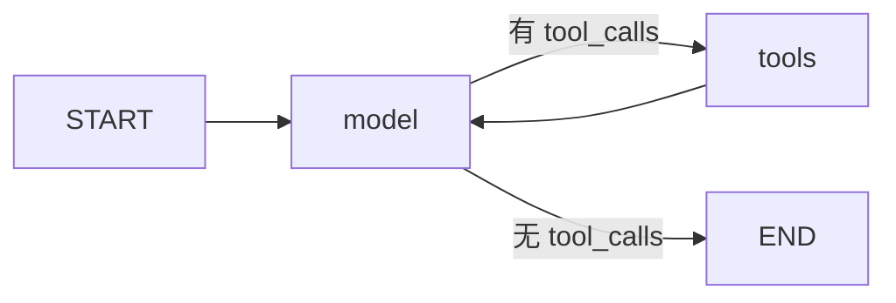
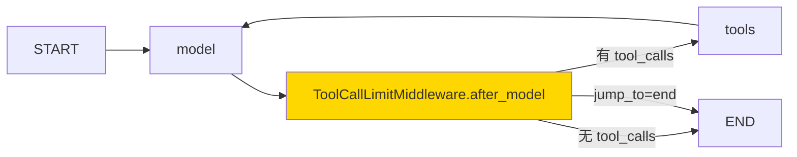
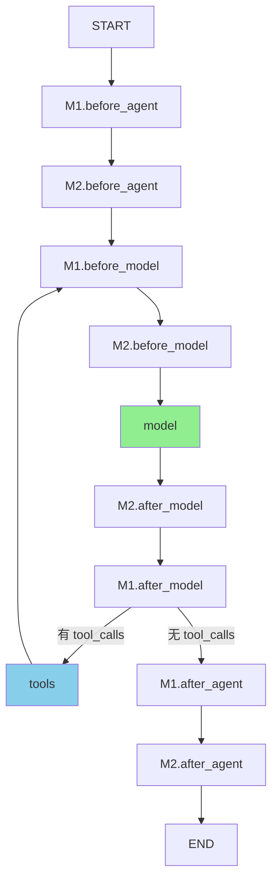

# LangChain Agent 循环与中间件阅读指南

> 版本: langchain==1.3.11 / langgraph (内置)
>
> 完整源码副本: [langchain-agent-src/](langchain-agent-src/) (`.ref` 后缀)

---

## 核心认知: create_agent 不是循环, 是图编译器

`create_agent` 编译一个 **LangGraph StateGraph**, 返回 `CompiledStateGraph`. 真正的循环由 LangGraph 运行时驱动. 理解这一点是读懂整个体系的前提.

项目调用方式 (`inference_coordinator.py:774`):

```python
agent = create_agent(llm, tools, system_prompt=system_prompt, middleware=middleware)
# 之后 agent.astream(input, config=runnable_config) 驱动执行
```

---

## 图拓扑

### 无中间件时 (最简形态)



### 项目实际拓扑 (4 个中间件)

项目中间件栈 (`inference_coordinator.py:741-764`):

```python
middleware = [
    ModelRetryMiddleware(...),                        # 只重写 awrap_model_call
    ToolCallLimitMiddleware(run_limit=20, ...),       # 只重写 aafter_model
    ToolDiscoveryMiddleware(dormant_tools, ...),      # 重写 awrap_model_call + awrap_tool_call
    SkillLoadMiddleware(skill_tool_map),              # 重写 awrap_model_call + awrap_tool_call
]
```

因为只有 `aafter_model` 和 `wrap` 类钩子被重写, 图拓扑仍是:



**注意**: `wrap_model_call` 和 `wrap_tool_call` 不产生额外图节点! 它们被链式组合后内嵌在 `model` 节点和 `tools` 节点内部执行.

### 如果有 before/after_agent 或 before/after_model 中间件



(项目当前不走此路径, 仅供参考)

---

## 第 1 层: model 节点内部 (factory.py L1481-1499)

```python
# agents_factory.ref L1481 (amodel_node, 项目走异步路径)
async def amodel_node(state, runtime):
    # 1. 构造 ModelRequest
    request = ModelRequest(
        model=model,
        tools=default_tools,
        system_message=system_message,
        response_format=initial_response_format,
        messages=state["messages"],
        tool_choice=None,
        state=state,
        runtime=runtime,
    )

    # 2. 如果有 wrap_model_call 中间件, 走链式组合; 否则直接执行
    if awrap_model_call_handler is None:
        model_response = await _execute_model_async(request)
    else:
        result = await awrap_model_call_handler(request, _execute_model_async)

    # 3. 返回 Command (状态更新)
    return _build_commands(model_response)
```

### _execute_model_async (factory.py L1453-1479)

```python
# agents_factory.ref L1453
async def _execute_model_async(request):
    # 1. 绑定工具: model.bind_tools(request.tools, ...)
    model_, effective_response_format = _get_bound_model(request)

    # 2. 拼接 system_message
    messages = request.messages
    if request.system_message:
        messages = [request.system_message, *messages]

    # 3. 调用模型
    output = await model_.ainvoke(messages)

    # 4. 处理输出 (结构化响应 / 普通 AIMessage)
    handled_output = _handle_model_output(output, effective_response_format)
    return ModelResponse(result=handled_output["messages"], ...)
```

### _get_bound_model (factory.py L1272-1404) — 不用细看

项目不传 `response_format`, 所以此函数对项目的实际路径是:

```python
# L1397-1404: 无结构化输出 - 标准模型绑定
if final_tools:
    return request.model.bind_tools(final_tools, tool_choice=request.tool_choice, ...)
return request.model.bind(**request.model_settings), None
```

**可跳过**: L1168-1395 的 `_handle_model_output` + `ToolStrategy` / `ProviderStrategy` / `AutoStrategy` 分支 (项目不走结构化输出路径).

---

## 第 2 层: 循环退出条件 (factory.py L1840-1954)

### model → tools / END (agents_factory.ref L1840)

```python
def model_to_tools(state):
    # 1. middleware 显式 jump_to → 强制跳转
    if jump_to := state.get("jump_to"):
        return _resolve_jump(jump_to, ...)

    # 2. 无 AIMessage → END
    last_ai_message, tool_messages = _fetch_last_ai_and_tool_messages(state["messages"])
    if last_ai_message is None:
        return end_destination

    # 3. AIMessage 无 tool_calls → END (经典退出条件)
    if len(last_ai_message.tool_calls) == 0:
        return end_destination

    # 4. 有未完成的 tool_calls → 路由到 tools 节点
    pending = [c for c in last_ai_message.tool_calls
               if c["id"] not in tool_message_ids]
    if pending:
        return [Send("tools", [tc]) for tc in pending]  # 并行执行!

    # 5. 有 structured_response → END
    # 6. tool_calls 已有对应 ToolMessage (人工注入) → 回 model
```

**关键**: `Send("tools", [tool_call])` 使得多个 tool_call 可以并行执行.

### tools → model / END (agents_factory.ref L1921)

```python
def tools_to_model(state):
    # 1. 所有执行的工具有 return_direct=True → END
    # 2. 执行了 structured_output 工具 → END
    # 3. 默认: 回 model 继续循环
```

---

## 第 3 层: 中间件钩子契约 (middleware_types.ref L383-811)

### AgentMiddleware 基类

```python
# middleware_types.ref L383
class AgentMiddleware(Generic[StateT, ContextT, ResponseT]):
    state_schema: type[StateT]     # 扩展状态字段 (如 ToolCallLimitState)
    tools: Sequence[BaseTool]       # 中间件注册额外工具
    name: str                       # 默认类名

    # === 状态钩子 (返回 state 更新 dict, 可包含 jump_to) ===
    def before_agent(self, state, runtime) -> dict | None: ...
    def before_model(self, state, runtime) -> dict | None: ...
    def after_model(self, state, runtime) -> dict | None: ...   # ← ToolCallLimitMiddleware 用
    def after_agent(self, state, runtime) -> dict | None: ...
    # (每个都有 async 版: abefore_agent, abefore_model, aafter_model, aafter_agent)

    # === 包裹钩子 (洋葱模型, 可修改 request / 重试 / 短路) ===
    def wrap_model_call(self, request, handler) -> ModelResponse | AIMessage: ...
    async def awrap_model_call(self, request, handler) -> ...: ...  # ← 项目 3 个中间件用
    def wrap_tool_call(self, request, handler) -> ToolMessage | Command: ...
    async def awrap_tool_call(self, request, handler) -> ...: ...   # ← 项目 2 个中间件用
```

### 洋葱模型: wrap_model_call 的链式组合

`create_agent` 在编译时把所有重写了 `wrap_model_call` 的中间件组合成一个链:

```python
# agents_factory.ref L1139-1146
async_handlers = [m.awrap_model_call for m in middleware_w_awrap_model_call]
awrap_model_call_handler = _chain_async_model_call_handlers(async_handlers)
```

执行顺序 (**list 中第一个是最外层**):

```
ModelRetry.awrap_model_call(request, handler=
    ToolDiscovery.awrap_model_call(request, handler=
        SkillLoad.awrap_model_call(request, handler=
            _execute_model_async(request)  ← 真正调 LLM
        )
    )
)
```

每个中间件可以:
- **修改 request**: `request.override(tools=..., system_message=...)` 后传给 handler
- **多次调 handler**: 重试 (ModelRetry)
- **跳过 handler**: 短路返回缓存结果
- **修改 response**: 拿到 handler 返回值后处理再返回

### wrap_tool_call 同理

```
ToolDiscovery.awrap_tool_call(request, handler=
    SkillLoad.awrap_tool_call(request, handler=
        ToolNode._execute_tool(request)  ← 真正执行工具
    )
)
```

---

## 第 4 层: 关键数据结构

### ModelRequest (middleware_types.ref L86)

```python
@dataclass(init=False)
class ModelRequest(Generic[ContextT]):
    model: BaseChatModel                          # 模型实例
    messages: list[AnyMessage]                     # 对话历史 (不含 system)
    system_message: SystemMessage | None           # 系统提示
    tool_choice: Any | None                        # 工具选择策略
    tools: list[BaseTool | dict[str, Any]]         # ← 中间件通过 override() 动态增删
    response_format: ResponseFormat | None         # 项目不用
    state: AgentState[Any]                         # 当前图状态
    runtime: Runtime[ContextT]                     # 运行时上下文
    model_settings: dict[str, Any]                 # 额外模型参数

    def override(self, **overrides) -> ModelRequest:
        """不可变修改: 返回新实例, 原对象不变."""
        return replace(self, **overrides)
```

**项目用法**:
- `_tool_discovery.py:85`: `request.override(tools=all_tools)` — 注入休眠工具
- `_skill_load.py:99`: `request.override(tools=all_tools)` — 注入 skill 关联工具

### ModelResponse (middleware_types.ref L271)

```python
@dataclass
class ModelResponse(Generic[ResponseT]):
    result: list[BaseMessage]          # 通常 [AIMessage], 可能含 ToolMessage
    structured_response: ResponseT | None = None  # 项目不用
```

### ToolCallRequest (tool_node.ref L133)

```python
class ToolCallRequest:
    tool_call: ToolCall           # {"name": ..., "args": ..., "id": ...}
    tool: BaseTool | None         # 要执行的工具实例 (动态注入时可 None)
    state: Any                    # 当前图状态
    runtime: ToolRuntime          # LangGraph 运行时

    def override(self, **overrides) -> ToolCallRequest:
        """不可变修改."""
        return replace(self, **overrides)
```

**项目用法**:
- `_tool_discovery.py:117`: `request.override(tool=self._dormant_tools[tool_name])` — 路由到正确工具
- `_skill_load.py:132`: `request.override(tool=self._all_injectable[tool_name])` — 同理

### AgentState (middleware_types.ref L347)

```python
class AgentState(TypedDict, Generic[ResponseT]):
    messages: Required[Annotated[list[AnyMessage], add_messages]]
    #                                    ↑ reducer: 追加而非替换
    jump_to: NotRequired[Annotated[JumpTo | None, EphemeralValue, PrivateStateAttr]]
    #                              ↑ 一次性: 用完即清
    structured_response: NotRequired[...]  # 项目不用
```

**关键**: `messages` 字段用 `add_messages` reducer, 意味着节点返回 `{"messages": [new_msg]}` 是**追加**到历史中, 不是替换.

**`jump_to`** 可选值: `"model"` | `"tools"` | `"end"` — 中间件通过 state 返回 `{"jump_to": "end"}` 强制终止循环.

---

## 第 5 层: 项目实际中间件

### ModelRetryMiddleware (middleware_model_retry.ref)

**钩子**: `awrap_model_call`

```python
async def awrap_model_call(self, request, handler):
    for attempt in range(self.max_retries + 1):
        try:
            return await handler(request)       # 调内层 (最终调 LLM)
        except Exception as exc:
            if not should_retry_exception(exc, self.retry_on):
                return self._handle_failure(exc, attempts_made)
            if attempt < self.max_retries:
                await asyncio.sleep(calculate_delay(...))  # 指数退避
            else:
                return self._handle_failure(exc, attempts_made)
```

**项目配置** (`inference_coordinator.py:743-751`):
- `max_retries`: 从 `retry_cfg` 读取
- `retry_on=_is_retryable_llm_exception`: 自定义异常过滤
- `on_failure=_llm_failure_message`: 自定义错误消息格式

**不用细看**: `_retry.py` 里的 `calculate_delay` / `validate_retry_params` 是标准退避逻辑.

### ToolCallLimitMiddleware (middleware_tool_call_limit.ref)

**钩子**: `aafter_model` (L464, 直接委托给同步 `after_model` L325)

```python
def after_model(self, state, runtime):
    # 1. 找最后一条 AIMessage
    # 2. 遍历 tool_calls, 按 limit 分为 allowed / blocked
    # 3. 更新 state 中的计数器
    # 4. blocked 非空时:
    #    - exit_behavior="error": 抛异常
    #    - exit_behavior="end": 注入 error ToolMessage + AIMessage, jump_to="end"
    #    - exit_behavior="continue": 只注入 error ToolMessage, 模型自行决定
```

**项目配置**: `ToolCallLimitMiddleware(run_limit=20, exit_behavior="end")` — 单次请求最多 20 次工具调用, 超限直接终止.

**不用细看**: `_build_final_ai_message_content` / `_build_tool_message_content` 是消息格式化.

### ToolDiscoveryMiddleware (项目自定义, src/tools/middleware/_tool_discovery.py)

**钩子**: `awrap_model_call` + `awrap_tool_call`

**模式**: 渐进式工具披露
1. 初始只有 `search_available_tools` 常驻工具
2. LLM 调用 search → ToolMessage 返回匹配工具名
3. 下一轮 `awrap_model_call` 检测到结果 → `request.override(tools=...)` 注入
4. LLM 调用新工具 → `awrap_tool_call` 路由到正确 BaseTool 实例

**关键约束**: 必须同时实现 `awrap_tool_call`, 否则 `_get_bound_model` 会验证工具名并抛 ValueError (factory.py L1304-1319).

### SkillLoadMiddleware (项目自定义, src/tools/middleware/_skill_load.py)

与 ToolDiscovery 同构, 触发源从 `search_available_tools` 变为 `load_skill`. per-skill 隔离: 不同 skill 的关联工具互不影响.

---

## 跳读指南

### agents_factory.ref (2007 行)

| 行号 | 内容 | 是否需要读 |
|------|------|-----------|
| 1-90 | 导入 | 跳过 |
| 91-740 | 辅助函数 + create_agent 重载签名 | 跳过 |
| 808-961 | create_agent 文档 + 参数 | 扫一遍参数说明 |
| 962-1068 | 初始化: 模型/工具/中间件收集 | **读** (理解工具收集逻辑) |
| 1083-1146 | 中间件钩子收集 + wrap 链组合 | **重点读** |
| 1148-1167 | StateGraph 创建 | 扫一眼 |
| 1168-1404 | _handle_model_output + _get_bound_model | 跳过 (结构化输出, 项目不用) |
| 1406-1499 | _execute_model_sync/async + model_node/amodel_node | **重点读** |
| 1500-1590 | 图节点注册 (middleware nodes) | 扫一眼 |
| 1592-1801 | 边连接 + 编译 | 扫一眼 (理解 entry/loop_entry/loop_exit/exit 概念) |
| 1804-1816 | _resolve_jump | **读** (6 行) |
| 1819-1954 | 条件边函数 | **重点读** |
| 1957-2007 | _add_middleware_edge + __all__ | 扫一眼 |

### middleware_types.ref (2161 行)

| 行号 | 内容 | 是否需要读 |
|------|------|-----------|
| 1-71 | 导入 + 类型变量 | 跳过 |
| 72-267 | ModelRequest + override | **重点读** |
| 270-341 | ModelResponse / ExtendedModelResponse / OmitFromSchema | 扫一眼 |
| 347-376 | AgentState / InputAgentState / OutputAgentState | **读** |
| 383-811 | AgentMiddleware 完整钩子定义 | **重点读** (尤其 wrap_model_call L491-584, wrap_tool_call L662-742) |
| 812-861 | 类型别名 | 跳过 |
| 862-2161 | 装饰器版本 (@before_model, @wrap_model_call 等) | 跳过 (项目不用装饰器形式) |

### tool_node.ref (2030 行)

| 行号 | 内容 | 是否需要读 |
|------|------|-----------|
| 133-200 | ToolCallRequest + override | **读** |
| 202-212 | ToolCallWrapper 类型 | 扫一眼 |
| 其余 | ToolNode 实现细节 | 不用读 (框架内部, 项目不直接交互) |

---

## 速查: .ref 文件对照

| 文件 | 对应源码 | 行数 |
|------|---------|------|
| `agents_factory.ref` | `langchain/agents/factory.py` | 2007 |
| `middleware_types.ref` | `langchain/agents/middleware/types.py` | 2161 |
| `middleware_model_retry.ref` | `langchain/agents/middleware/model_retry.py` | 312 |
| `middleware_tool_call_limit.ref` | `langchain/agents/middleware/tool_call_limit.py` | 487 |
| `tool_node.ref` | `langgraph/prebuilt/tool_node.py` | 2030 |

---

## 速查: 项目 import 映射

| 项目文件 | 导入 |
|---------|------|
| `inference_coordinator.py` | `create_agent`, `ModelRetryMiddleware`, `ToolCallLimitMiddleware` |
| `_tool_discovery.py` | `AgentMiddleware`, `ModelRequest`, `ToolCallRequest` |
| `_skill_load.py` | `AgentMiddleware`, `ModelRequest`, `ToolCallRequest` |
| `research_agent.py` | `create_agent`, `ModelRetryMiddleware` |
| `geo_research/service.py` | `create_agent`, `ModelRetryMiddleware` |
