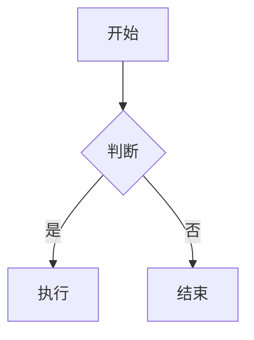

# GFM 语法速查

导出工具完整支持 GitHub Flavored Markdown (GFM), 并额外支持 LaTeX 数学、Callout、图表代码块。以下为各特性的确切写法。

## 标题与段落

```markdown
# 一级标题 (文档建议以此开头, 用于自动生成文件名)
## 二级标题
### 三级标题
#### 四级标题

普通段落之间空一行。
同一段内换行用行尾两个空格, 或直接连写。
```

## 强调

```markdown
**粗体**
*斜体*
~~删除线~~
**粗体 *嵌套斜体***
```

## 列表

```markdown
无序:
- 项一
- 项二
  - 子项 (缩进两格)

有序:
1. 第一步
2. 第二步

任务列表 (GFM):
- [x] 已完成
- [ ] 未完成
- [ ] 待办事项
```

## 表格 (pipe_tables)

```markdown
| 左对齐 | 居中 | 右对齐 |
|:-------|:----:|-------:|
| a      | b    | c      |
| 长内容 | 数据 | 100    |
```

- 表头与分隔行必填, 对齐由 `:` 位置控制
- 单元格内换行用 `<br>`
- 单元格内可用行内代码、粗体、链接

## 链接与自动链接

```markdown
[显示文本](https://example.com)
[带标题](https://example.com "悬浮标题")
<https://example.com>          <!-- 尖括号自动链接 -->
https://example.com            <!-- 裸 URL 自动识别 -->
```

## 图片

```markdown

```

注: 图表 (mermaid/vega-lite/markmap) 优先用下方代码块语法, 预处理器自动渲染为图片, 无需手动贴图。

## 代码

行内: `` `code` ``

围栏代码块 (自动语法高亮):

````markdown
```python
def hello():
    print("hi")
```
````

语言标识决定高亮, 常用: python / javascript / bash / json / sql / yaml / go / rust。

## 脚注

```markdown
这是正文[^1], 另一处引用[^note]。

[^1]: 第一条脚注内容。
[^note]: 命名脚注, 可用任意标识符。
```

脚注定义放在文档任意位置, 渲染时自动归集到文末并编号。

## Callout (提示块)

```markdown
::: tip
提示内容, 用醒目样式呈现。
:::

::: warning
警告内容。
:::
```

支持类型: `note` / `tip` / `warning` / `caution` / `important` / `info`。渲染为带标签的引用块。

## 引用块

```markdown
> 引用内容
> 多行延续
>
> > 嵌套引用
```

## 分隔线

```markdown
---
```

单独一行三个短横线。

## LaTeX 数学公式

```markdown
行内公式: 质能方程 $E = mc^2$。

块级公式 (独占一行):

$$
\int_{-\infty}^{\infty} e^{-x^2} dx = \sqrt{\pi}
$$
```

## 图表代码块

预处理器自动渲染为 PNG 嵌入文档, 三种引擎:

### mermaid (流程图/时序图/状态图)

````markdown

````

### vega-lite (数据图表)

````markdown
```vega-lite
{
  "data": {"values": [{"x": "A", "y": 28}, {"x": "B", "y": 55}]},
  "mark": "bar",
  "encoding": {"x": {"field": "x"}, "y": {"field": "y"}}
}
```
````

### markmap (思维导图)

````markdown
```markmap
# 中心主题
## 分支一
### 子项
## 分支二
```
````

完整图表语法见 chart_maker skill 的 references。

## HTML 降级规则

预处理器将部分 HTML 转为等价 Markdown, 其余保留:

| HTML | 渲染结果 |
|------|---------|
| `<details><summary>标题</summary>内容</details>` | 引用块 |
| `<mark>文本</mark>` | **粗体** |
| `<sub>` / `<sup>` | 普通文本 (上下标降级) |
| `<br>` | 换行 |
| `<hr>` | 分隔线 |

重要信息不要依赖上下标, 避免语义丢失。
